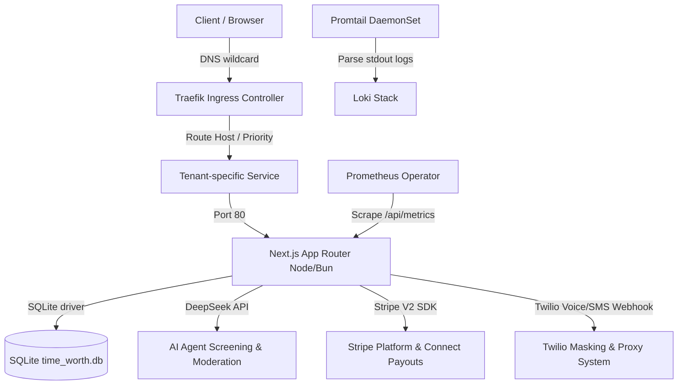

# Time Guild (TimeWorth / AURA) MVP Launch Plan & Architecture Assessment

## 1. Executive Summary & Product Vision
Time Guild (TimeWorth) is a high-trust, AI-accelerated concierge scheduling marketplace. It allows clients to discover, screen, and book virtual or in-real-life (IRL) sessions with expert creators (providers). 

The platform's core differentiator lies in its **two-sided trust layer**:
1. **AI Concierge Screening**: Expert creators set screening prompts. Clients chat with an AI booking assistant that qualifies them before revealing the booking and checkout trigger.
2. **Dynamic Kubernetes Escrow Sandbox**: Dynamic, isolated subdomains (`tenant-*.timeguild.xyz`) are spun up for verified providers. Transactions are backed by Stripe Connect (V2 SCT architecture) and fully instrumented for SRE monitoring.

---

## 2. Full Architecture Assessment

Across BOTH repositories (`time-guild` and `time-guild-gitops`), the system's architectural footprint is summarized below:



### A. Frontend Architecture
* **Framework**: Next.js 16 (App Router), configured with force-dynamic home rendering and cache-busting to prevent static state stale issues.
* **Component Library**: Tailwind CSS, shadcn/ui components (radix-ui wrappers), Lucide React.
* **State Management**: React Query (TanStack Query) for API caching and data fetching.

### B. Backend Architecture
* **Runtime**: Bun 1.3.14 (in-cluster alpine container) and Node.js.
* **Database Driver**: `better-sqlite3` on Node.js / `bun:sqlite` in production container.
* **API Endpoints**: Structured Next.js API Route Handlers. 
* **Middleware**: W3C-compliant traceparent injection/extraction, JSON request logging, CORS, and noise-filtering request logging.

### C. Database Model & SQLite Schema
The local database `time_worth.db` contains 9 primary tables:
1. `tenants`: Subdomain namespace definitions.
2. `users`: Credentials, session references, and base role state (`creator` vs `client`).
3. `creator_profiles`: Bio, tags, pricing, availability description, and AI assistant configurations.
4. `slots`: Individual calendar availability slots with status values (`available`, `reserved`, `booked`).
5. `bookings`: Booking status (`draft`, `awaiting_payment`, `confirmed`, `completed`, `paid`, `cancelled`, `refunded`), Stripe metadata, and completion PINs.
6. `stripe_accounts`: Stripe Connect IDs, onboarding state, and payout verification status.
7. `webhook_logs`: Stored Stripe webhook event payloads for audit logs.
8. `chat_messages`: Logs of screening chats between clients and AI concierge assistants.
9. `reviews`: Airbnb-style double-blind rating scores.

### D. Payment Integrations
* **Stripe Connect V2 SCT (Separate Charges & Transfers)**:
  - Payments are charged by the platform account via Stripe Checkout.
  - The platform retains a 15% fee (or 5% for repeat customer sessions).
  - The remaining 85% creator payout is transferred to the creator's connected Express account via `stripe.transfers.create` during PIN verification.
  - Test/Live mode toggle is dynamically integrated into the UI.

### E. Telephony, Voice, and Twilio
* Webhook endpoint `/api/voice/[tenantId]` parses JSON webhook events from Twilio Conversation Relay.
* Currently configured to mock SMS routing and log SMS messages in the database. Real Twilio number proxying needs to be fully wired.

### F. AI Concierge & Screening Layer
* Screenings are processed by `POST /api/agent/chat` targeting the DeepSeek Chat API (`deepseek-chat`).
* Includes a built-in fallback simulator for offline testing.
* Employs a regex-based `scanAndObfuscateLeakage` script to prevent contact leakage.

### G. Observability & SRE Stack (GitOps Configured)
* **Scraper**: Prometheus Operator scraping `/api/metrics` across namespaces via a `ServiceMonitor`.
* **Exposed SLO Metrics**: `timeguild_http_requests_total` (counter) and `timeguild_http_request_duration_seconds` (histogram).
* **Alertmanager Routing**: Routes warnings to Slack and criticals to PagerDuty.
* **Logs**: Loki/Promtail daemonset relabeling namespace logs by tenant.
* **Dashboard**: Labeled Grafana dashboard ConfigMap auto-discovered and loaded inside the UI.

---

## 3. MVP Readiness Score & Gap Analysis

### MVP Readiness Score: **78% / 100%**

### A. Features Currently Working
* **Multi-Tenant Routing**: Wildcard Traefik routing mapped correctly to creator subdomains.
* **Stripe Connect V2 Onboarding**: Express-style onboarding with `defaults.responsibilities` liabilities assigned to the application.
* **Stripe Webhook Concurrency**: Webhook verification, atomic booking confirmations, and double-booking auto-refunds.
* **Telemetry & Observability**: Metrics, logs, alerting rules, and Grafana dashboard single pane of glass.
* **AI Concierge chat qualification**: Screening clients using DeepSeek and enabling booking buttons.
* **airbnb-style Double-Blind Reviews**: Star distributions for both creators and clients.

### B. Features Partially Implemented
* **Availability Creation**: Onboarding is restricted to configuring a single initial date/time range rather than a broad scheduler.
* **Pricing Model**: Assumptions of hourly rates multiply price by duration, creating inconsistencies for flat-rate/session pricing.
* **AI Leakage Prevention**: Current leak scanner uses simple regex rules; it lacks AI risk scoring, profanity, and harassment checks.
* **Twilio Masking**: Standard SMS messages are mocked but the Twilio proxy pipeline for routing calls/SMS is not fully live.

### C. Features Blocking a Real User Test
1. **Onboarding Availability Scheduler**: Creators cannot configure a multi-day range of availability (e.g. Mon-Fri 9am-5pm for 90 days).
2. **Pricing Model Integration**: Missing flat-rate/per-session vs. hourly selection in onboarding, profiles, and Stripe calculations.
3. **AI-Assisted Moderation**: No risk assessment, profanity filtering, or backend moderation event tables for human review.
4. **Twilio Proxy Intermediary**: Call/SMS forwarding between masked virtual numbers is missing.

### D. Architectural Risks
* **SQLite File Concurrency**: SQLite writes block during simultaneous payments. Write locks must be mitigated with appropriate busy timeout configuration.
* **Dynamic Namespace Leakage**: Deleting db entries must trigger namespace deletion to prevent stale pod leakages in K3s. (Partially mitigated via administrative database reset script).

### E. Technical Debt
* **Config Duplication**: Dual repositories copy deployment configurations. Changes must sync carefully.
* **On-the-fly Slot Creation**: Fallback checkout codes generate slot UUIDs on the fly rather than rejecting non-existent slots.

---

## 4. Redesigned Models

### A. Scheduling & Availability Model
Instead of forcing the creator to set a single date-local block, onboarding and slot configuration will be updated to accept a structured scheduling model:
* **Inputs**:
  - `startDate`: ISO date string (when the availability window starts).
  - `endDate`: ISO date string (when the availability window closes, e.g. 90 days out).
  - `daysOfWeek`: JSON array of integers (`[1, 2, 3, 4, 5]` for Mon-Fri).
  - `hours`: Array of objects containing `{ start: "09:00", end: "17:00" }`.
  - `timeZone`: String identifier (e.g., `America/New_York`).
  - `slotDurationMinutes`: Duration of individual bookings (e.g., 60 minutes).
* **Generation Engine**:
  A slot generator script will run upon publishing. It populates individual `slots` records in the database for every interval within the window, excluding already occupied blocks.

### B. Service Pricing Model
The database table `creator_profiles` will be updated to support a `pricing_type` column:
1. **Flat Rate / Per Session (`flat`)**:
   - Provider defines: `session_name`, `session_description`, and `price_flat`.
   - The price paid is exactly `price_flat`. Duration is informational only and does not scale the price.
2. **Hourly Rate (`hourly`)**:
   - Provider defines: `price_hourly`, `min_duration_hours`, and `max_duration_hours`.
   - The customer selects the booking duration `h` (where `min_duration_hours <= h <= max_duration_hours`).
   - The checkout price is calculated as `price_hourly * h`.

### C. Stripe Connect Marketplace Architecture (SCT)
Verify that the flow of funds conforms to the diagram below:
```
[Client Credit Card] 
       |
       v (Stripe Checkout Session)
[Platform Stripe Account] (Holds funds in transit)
       |
       +---> [Platform Fees Account] (Retains 15% platform commission)
       |
       v (Stripe Transfer: stripe.transfers.create)
[Creator Connected Account] (Receives 85% net creator share)
       |
       v (Stripe Instant Payout)
[Creator Bank Account / Debit Card]
```
* **Idempotency**: Pass `idempotencyKey: "transfer_booking_{bookingId}"` to prevent duplicate transfer attempts.
* **Partial Refunds**: In the event of rescheduling disputes, refunds will be initiated from the platform account, pulling the proportional share back from the connected account balance if a transfer has already been executed.

### D. AI Trust & Safety (Moderation & Anti-Leakage)
* Expand the leakage scanner to route suspicious text through a moderation query or scan for specific patterns (e.g., email strings, phone number groups, alternative payment sites like Venmo or CashApp).
* **Moderation Events Table**:
  ```sql
  CREATE TABLE IF NOT EXISTS moderation_events (
    id TEXT PRIMARY KEY,
    booking_id TEXT,
    chat_message_id TEXT,
    offender_id TEXT NOT NULL,
    risk_score REAL NOT NULL, -- 0.0 to 1.0
    flagged_terms TEXT, -- JSON array of matches
    created_at DATETIME DEFAULT CURRENT_TIMESTAMP
  );
  ```
* Risk scores `> 0.8` block message dispatch and prompt the user to keep transactions on-platform.

### E. Twilio Proxy Intermediary
* Virtual number masking prevents personal details disclosure.
* Mapped in the database:
  ```sql
  CREATE TABLE IF NOT EXISTS phone_masks (
    id TEXT PRIMARY KEY,
    creator_id TEXT UNIQUE REFERENCES users(id),
    twilio_number TEXT NOT NULL,
    real_number TEXT NOT NULL
  );
  ```
* Inbound SMS/calls to `twilio_number` are programmatically routed to the recipient's `real_number`.

---

## 5. Day-by-Day Implementation Plan

### Day 1: Onboarding, Scheduling & Pricing Engine
* **Tasks**:
  1. Add `pricing_type`, `session_name`, `session_description` to `creator_profiles` schema.
  2. Implement slot generation logic based on availability days/hours (Mon-Fri 9-5 range).
  3. Redesign onboarding screen to allow selecting Flat Rate vs. Hourly pricing and date-range scheduling.
* **Repos affected**: `time-guild` (UI, API, database migrations).

### Day 2: Payment Consistency & Stripe Connect Verification
* **Tasks**:
  1. Refactor `/api/stripe/checkout` to compute charges based on `pricing_type`.
  2. Map metadata parameters correctly (Pricing Type, Service ID, Platform Fee, Net Share).
  3. Validate SCT payouts, transfer groups, and idempotency keys in `src/lib/trust-rules.ts`.
* **Repos affected**: `time-guild`.

### Day 3: Booking Management & Rescheduling Workflows
* **Tasks**:
  1. Build a customer dashboard for viewing active bookings.
  2. Implement client/provider cancellation rules in `src/lib/trust-rules.ts`.
  3. Implement reschedule API endpoint `/api/bookings/reschedule` enforcing 24h limits.
* **Repos affected**: `time-guild`.

### Day 4: AI Trust & Safety & Twilio Proxy Communication
* **Tasks**:
  1. Add `moderation_events` table to SQLite schema.
  2. Upgrade `scanAndObfuscateLeakage` to trigger warning logs and record events in `moderation_events` when off-platform keywords match.
  3. Set up virtual SMS/call forwarding routes.
* **Repos affected**: `time-guild`.

### Day 5: Observability Verification & End-to-End Testing
* **Tasks**:
  1. Add new business metrics to `/api/metrics` (platform fee sums, pricing type usage metrics).
  2. Update Grafana dashboards in `timeguild-dashboard.yaml` to visualize business metrics.
  3. Execute automated testing scripts to simulate the first real user booking and payment.
* **Repos affected**: `time-guild`, `time-guild-gitops`.

---

## 6. Repository-by-Repository Task Breakdown

### Repo: `time-guild` (Main App)
* [ ] Database migration: Add pricing type columns and `moderation_events` schema.
* [ ] UI Refactoring: Update onboarding components to support date-range availability and pricing selectors.
* [ ] API Endpoint: `/api/slots` generation engine.
* [ ] API Endpoint: `/api/bookings/reschedule` and cancel rules.
* [ ] API Endpoint: AI moderation integration in `/api/agent/chat`.
* [ ] Telemetry: Expose business KPIs in `/api/metrics`.

### Repo: `time-guild-gitops` (Infra/GitOps)
* [ ] Update Grafana Dashboard ConfigMap `timeguild-dashboard.yaml` with revenue, pricing model distribution, and platform fee panels.
* [ ] Check Prometheus rules for high alert sensitivity during testing.
