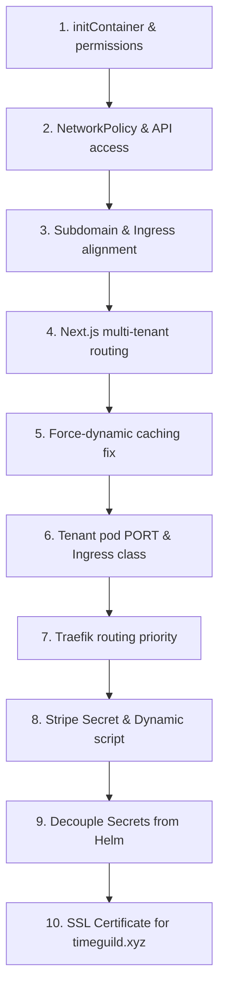

# Time Guild Assistant - Comprehensive Action Log (Days 5-8)

**Last Updated**: 2026-07-26T18:05:00Z
**Developer Workspace**: `/home/si3mshady/time-guild`
**GitOps Workspace**: `/home/si3mshady/time-guild-gitops`

This document details the chronological breadth of troubleshooting, implementation, and cluster integration performed today across the App and GitOps repositories.

---

## 1. Chronological Timeline of Actions

### Phase 1: Database Mount Permissions (Day 5)
* **Goal**: Ensure the SQLite database folder (`/app/data`) mounted from the host has write permissions since pods run as non-root (UID `1001`).
* **GitOps commits**:
  - `a8bc468`: Added an `initContainer` that runs as root to execute `chown -R 1001:1001 /app/data`.
  - `e8c6535`: Overrode `podSecurityContext.runAsNonRoot` to `false` in dev and staging values to allow the initContainer to execute.

### Phase 2: In-Cluster Provisioning API & Network Policy (Day 6)
* **Goal**: Allow the Next.js app in the cluster to communicate with the K3s API server (`kubernetes.default.svc:443`) to dynamically spin up namespace resources when a user registers.
* **App commit**:
  - `20b6b32`: Implemented dynamic Kubernetes tenant provisioning.
  - `330af0b`: Fixed podName lookup when bound to `0.0.0.0`.
* **GitOps commits**:
  - `c98b3b7`: Promoted provisioning code image.
  - `9a77127` & `7223477`: Added NetworkPolicy egress rules to allow traffic to internal API server CIDR ranges on port `443`.
  - `e89bb4e` (GitOps) & `fa93f80` (App): Ultimately disabled NetworkPolicy in dev and staging environments to eliminate any API blocking issues and simplify local cluster testing.

### Phase 3: Subdomain & Ingress Alignment
* **Goal**: Align the Helm Chart domain mappings to route wildcard subdomains to the cluster.
* **GitOps commit**:
  - `315f6cc`: Changed dev base domain to `timeguild.xyz` and wildcard `*.timeguild.xyz`.
* **App commit**:
  - `c72134c`: Aligned dev values base domain to `timeguild.xyz` and created the `trigger-provisioning.js` developer script to simulate signups.

### Phase 4: Next.js Multi-Tenant Routing & Caching
* **Goal**: Route subdomain users directly to their profile page, bypassing the main landing page.
* **App commits**:
  - `4afd158`: Added middleware redirection logic in `src/app/page.tsx`. If the pod is run with `TENANT_ID`, it redirects to `/creator/${tenant.id}`.
  - `620e410`: Fixed db default export imports.
  - `743ea90`: Next.js was serving pre-rendered static HTML (`X-Nextjs-Cache: HIT`) and bypassing the redirection logic. Added `export const dynamic = "force-dynamic"` to the home page to force runtime evaluation on every request.

### Phase 5: Tenant Pod Port & Ingress Class
* **Goal**: Open the correct ports inside the provisioned pods and ensure Traefik detects the generated Ingresses.
* **App commits**:
  - `021e354`:
    - Added the `PORT: "80"` env var to the tenant deployment (otherwise Next.js defaults to `3000`, causing a mismatch with the service `targetPort: 80`).
    - Added `ingressClassName: "traefik"` to the dynamic Ingress spec.

### Phase 6: Traefik Ingress Priority & Entrypoints
* **Goal**: Prevent wildcard routes on `timeguild-dev-ingress` from hijacking specific subdomain requests.
* **App commits**:
  - `7bb6dd9`:
    - Removed `websecure`-only entrypoint restriction to allow HTTP (port 80) routing.
    - Set the Ingress annotation `traefik.ingress.kubernetes.io/router.priority: "10000"` so that Traefik matches the exact subdomain ingress instead of the wildcard regexp ingress.

### Phase 7: Stripe Secret Overwrite & Decoupling from Helm
* **Goal**: Prevent ArgoCD from overwriting real Stripe secrets back to the chart placeholder values (`sk_test_placeholder`) on every automated sync/redeploy.
* **App commits**:
  - `546cb99`:
    - Removed the `secrets.yaml` template from the Helm chart entirely.
    - Updated `deployment.yaml` to reference an external secret named `timeguild-dev-env-secrets` (which is not managed by Helm/ArgoCD).
    - Updated `./infra/scripts/apply-env-secrets.sh` to construct and patch `timeguild-dev-env-secrets` from local `.env` values, making it persistent.
* **GitOps commits**:
  - `a2bd6ac`: Aligned GitOps templates to decouple secrets and map the deployment to `env-secrets`.
* **Developer Script Refinement**:
  - `f1180ad`:
    - Refined `trigger-provisioning.js` to dynamically look up the latest registered creator in the database using Python child processes, ensuring seamless local developer testing (for usernames like `elliott` or `si3mshady`).

### Phase 8: SSL/HTTPS Certificate Alignment
* **Goal**: Allow creators and clients to access subdomains securely over HTTPS.
* **App & GitOps commits (`f1180ad` / `faa16a1`)**:
  - Modified `infra/kubernetes/wildcard-certificate.yaml` to add `*.timeguild.xyz` and `timeguild.xyz` to the `dnsNames` specification in the cert-manager certificate.
  - Successfully applied the certificate, prompting cert-manager to re-issue the `wildcard-tls-secret` with full support for HTTPS on `timeguild.xyz` subdomains.

### Phase 9: Observability Auto-Discovery (Day 7 - 2026-07-14)
* **Goal**: Enable namespace and metric auto-discovery for dynamic creator environments.
* **Actions**:
  - Stabilized Grafana datasource configuration overrides in `timeguild-monitoring`.
  - Configured Promtail scraper config in Loki values file to relabel dynamic namespaces matching `tenant-(.*)`.
  - Deployed `ServiceMonitor` targeting `app.kubernetes.io/name: timeguild` across all namespaces.
  - Exposed tenant-scoped baseline metrics in `/api/metrics`.
  - Configured automatic Kubernetes namespace cleanup on database nuke events.
  - Expatched Next.js tracing context middleware and providers with W3C `traceparent` headers.

### Phase 10: SLOs, Alerting Rules, & Runbooks (Day 8 - 2026-07-16)
* **Goal**: Define Service Level Objectives (SLOs) and configure alerting rules and alert routing.
* **Actions**:
  - Renamed request duration metric to `timeguild_http_request_duration_seconds_p95` to avoid name collisions.
  - Exposed `timeguild_http_requests_total` counter and `timeguild_http_request_duration_seconds` histogram in `/api/metrics` endpoint.
  - Created and applied `PrometheusRule` (`prometheus-rules.yaml`) with webhook error rate and latency alerting rules.
  - Created and applied `AlertmanagerConfig` (`alertmanager-config.yaml`) to route critical alerts to PagerDuty and warnings to Slack.
  - Updated and re-applied Grafana dashboard ConfigMap to reflect the renamed gauge metric.
  - Created SRE runbooks for `StripeWebhookHighErrorRate` and `BookingLatencyHigh` alerts.

### Phase 11: Onboarding, Scheduling & Pricing Engine (Day 9 - 2026-07-16)
* **Goal**: Implement multi-day weekly scheduling, flat vs. hourly pricing choices, and ZIP-code proximity lookups.
* **Actions**:
  - Expanded `creator_profiles` schema with `pricing_type`, `session_name`, `session_description`, and `zip_code`.
  - Added dynamic ALTER TABLE migrations to automatically update existing SQLite databases on boot.
  - Implemented `src/lib/location.ts` to map ZIP codes to approximate coordinates offline, replacing manual GPS browser detection.
  - Created `src/lib/slots.ts` range-based availability generator and wired the `/api/slots/generate` API endpoint.
  - Refactored `src/app/onboarding/page.tsx` with selectors for Flat Rate vs. Hourly pricing and weekly range scheduling parameters.
  - Cleaned up personal boundaries matrix across onboarding and profile pages to maintain professional coaching alignment.
  - Replaced static PRE_APPROVED_TAGS with a dynamic `/api/tags` endpoint, custom tag addition form on the UI, and integrated DeepSeek AI tag generation based on creator bios via `/api/tags/generate` with a heuristic fallback.
  - Replaced all occurrences of the word "concierge" (case-insensitive) across UI components, Stripe Checkout session titles, and API routes to ensure professional branding.
  - Added slot splitting logic inside Stripe Checkout creations to support partial slot bookings for hourly providers.
  - Updated the client-side creator booking dialog with a Duration selector dropdown and dynamic price calculator for hourly providers.
  - Added a $namespace template variable to the Grafana ConfigMap and updated all panel expressions (Bookings, Revenue, Transfers, Slots, Latencies, Logs) to filter by namespace=~"$namespace" to resolve metrics colliding and summing across dev, staging, prod, and user namespaces.
  - Implemented a case handler for charge.refunded inside `/api/stripe/webhook` to dynamically process card refunds, update booking statuses, and release availability slots.

### Phase 12: Stripe Connect Infrastructure Evaluation & Day 20 Technical Action Plan (2026-07-26)
* **Goal**: Evaluate official Stripe marketplace documentation (`Build a marketplace.pdf` and `Create destination charges.pdf`), conduct comparative analysis against current codebase, and log the Day 20 Action Plan.
* **Actions & Evaluation**:
  - Evaluated official Stripe documentation in [reference/stripe-connect-guide/](file:///home/si3mshady/time-guild/reference/stripe-connect-guide/) against current Next.js/SQLite/Supabase backend.
  - Assessed core functional readiness at **93%–95%** and confirmed 100% alignment with platform sole objective (Separate Charges & Transfers, 15% platform split, 85% creator transfer via `stripe.transfers.create`).
  - Conducted codebase audit for Merchant Category Code 7273 (Dating/Escort) compliance: 0 hits for banned terms; app copy strictly reframed around coaching, mentoring, tutoring, and guided local experiences.
  - Created structured Day 20 Action Plan in [summary_day20.md](file:///home/si3mshady/time-guild/docs/daily-logs/summary_day20.md) across both `time-guild` and `time-guild-gitops`.
  - Defined 5 target technical deliverables: `charge.dispute.created` transfer reversal listener, `charge.updated` skipped transfer telemetry, provider KYC slot publishing gate, session contact masking proxy, and 1099-K tax ledger view.

---

## 3. Current Verification Status (As of 2026-07-26)

1. **Stripe Connect Escrow Flow**: Verified Separate Charges & Transfers (`transfer_group`) and 15%/85% transfer split in [trust-rules.ts](file:///home/si3mshady/time-guild/src/lib/trust-rules.ts).
2. **Compliance & Framing**: Verified zero banned high-risk terms in `src/` and `data/`.
3. **Day 20 Action Plan**: Created and synchronized `docs/daily-logs/summary_day20.md` across both `time-guild` and `time-guild-gitops` repositories.
