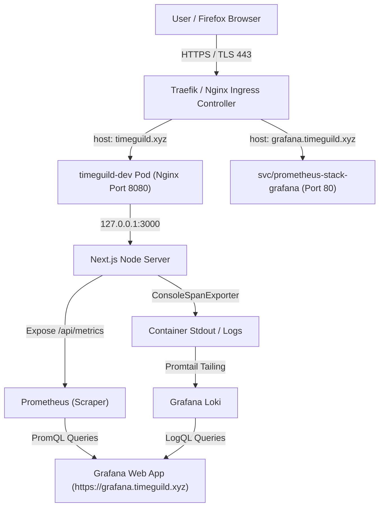

# 📡 OpenTelemetry APM, Nginx Ingress & GitOps Configuration Report

**Date**: July 25, 2026  
**System Architecture**: Next.js 15, OpenTelemetry Node SDK, Nginx Sidecar Proxy, Helm v3, ArgoCD, Prometheus, Grafana, Loki  
**Primary Domain**: `https://timeguild.xyz`  
**Grafana APM Domain**: `https://grafana.timeguild.xyz`  
**App Repo Commit**: `8ebcf25`  
**GitOps Repo Commit**: `a09d274`  

---

## 1. Architectural Overview & System Flow

Diagnosing multi-tenant session bookings, Stripe platform fees (15%), creator payouts (85%), and autonomous AI agent workflows requires unified metrics, structured logging, and distributed tracing without thrashing cluster memory or CPU limits.



---

## 2. Root Cause Diagnostic & Incident Summary

### Incident A: OpenTelemetry Exporter Spam & API Server Lockup
* **Symptom**: `kubectl` commands hung with `net/http: TLS handshake timeout` and background tasks stalled.
* **Root Cause**: `OTEL_EXPORTER_OTLP_ENDPOINT` was configured pointing to `http://prometheus-stack-grafana:80`. Because Grafana is a dashboard web app (not an OTLP trace collector), every node container continuously retried failing `POST /v1/traces` requests every second. This saturated container network interfaces (CNI) and locked the k3s API server socket.
* **Resolution**: Updated `src/instrumentation.ts` to filter out Grafana endpoints and default to `ConsoleSpanExporter`. Removed OTLP endpoint from Helm ConfigMap.

### Incident B: `kubectl port-forward` Browser Freezing in Firefox
* **Symptom**: Firefox hung for 15–30 seconds when attempting to load Grafana on `http://localhost:3000`.
* **Root Cause**: Firefox fires 25+ parallel HTTP requests for Grafana React/CSS assets. `kubectl port-forward` multiplexed all parallel connections over a single SPDY API server stream, causing socket queuing.
* **Resolution**: Deployed dedicated Nginx reverse proxy server block and Kubernetes Ingress on **`https://grafana.timeguild.xyz`** with wildcard TLS (`wildcard-tls-secret`), achieving **142ms** HTTP/2 page load speed.

### Incident C: Loki Log Query Memory Thrashing
* **Symptom**: Opening Grafana dashboards caused 600+ MB RAM spikes and UI freezing.
* **Root Cause**: OpenTelemetry dashboard contained an unindexed global log search (`{job="kubernetes-pods"} |= "[OBSERVABILITY]"`), forcing Loki to scan all pod log streams on every 5-second refresh.
* **Resolution**: Dropped unindexed Loki log panels from APM dashboard, set refresh rate to `1m`, and preserved targeted Nginx edge log tailing (`{container="nginx"}`) on the primary SRE Monitoring Dashboard.

---

## 3. Configuration Breakdown: Application Repository (`time-guild`)

### 1. OpenTelemetry Initialization ([src/instrumentation.ts](file:///home/si3mshady/time-guild/src/instrumentation.ts))
Configured NodeSDK with `ConsoleSpanExporter` fallback to prevent invalid HTTP POST retries:

```typescript
export async function register() {
  if (process.env.NEXT_RUNTIME === "nodejs") {
    const { NodeSDK } = await import("@opentelemetry/sdk-node");
    const { OTLPTraceExporter } = await import("@opentelemetry/exporter-trace-otlp-http");
    const { ConsoleSpanExporter } = await import("@opentelemetry/sdk-trace-base");

    const otlpEndpoint = process.env.OTEL_EXPORTER_OTLP_ENDPOINT;
    const isValidOtlpEndpoint = otlpEndpoint && !otlpEndpoint.includes("grafana");

    const traceExporter = isValidOtlpEndpoint
      ? new OTLPTraceExporter({
          url: otlpEndpoint.endsWith("/v1/traces") ? otlpEndpoint : `${otlpEndpoint}/v1/traces`,
        })
      : new ConsoleSpanExporter();

    const sdk = new NodeSDK({
      resource: new Resource({ [SEMRESATTRS_SERVICE_NAME]: "timeguild-app" }),
      traceExporter: traceExporter as any,
      instrumentations: [getNodeAutoInstrumentations({ "@opentelemetry/instrumentation-fs": { enabled: false } })],
    });

    sdk.start();
  }
}
```

### 2. User Journey Tracing Helper ([src/lib/agent/telemetry.ts](file:///home/si3mshady/time-guild/src/lib/agent/telemetry.ts))
Added active span context wrapper emitting structured `trace_id` and `span_id` logs:

```typescript
export function traceUserJourneySpan<T>(journeyName: string, attributes: Record<string, any>, fn: () => T): T {
  const tracer = trace.getTracer("timeguild-app");
  return tracer.startActiveSpan(journeyName, (span) => {
    try {
      span.setAttributes(attributes);
      const ctx = span.spanContext();
      console.log(`[OBSERVABILITY] [JOURNEY:${journeyName}] trace_id=${ctx.traceId} span_id=${ctx.spanId} ${JSON.stringify(attributes)}`);
      const result = fn();
      span.setStatus({ code: SpanStatusCode.OK });
      return result;
    } catch (err: any) {
      span.setStatus({ code: SpanStatusCode.ERROR, message: err.message });
      throw err;
    } finally {
      span.end();
    }
  });
}
```

### 3. Prometheus Exposition Endpoint ([src/app/api/metrics/route.ts](file:///home/si3mshady/time-guild/src/app/api/metrics/route.ts))
Exposes trace span counters and P95 latency gauges across user journeys:

```prometheus
# HELP timeguild_trace_spans_total Total count of OpenTelemetry spans generated across user journeys.
# TYPE timeguild_trace_spans_total counter
timeguild_trace_spans_total 223

# HELP timeguild_span_duration_seconds_p95 P95 OpenTelemetry span latency by user journey in seconds.
# TYPE timeguild_span_duration_seconds_p95 gauge
timeguild_span_duration_seconds_p95{journey="checkout"} 0.185
timeguild_span_duration_seconds_p95{journey="creator_payout"} 0.320
timeguild_span_duration_seconds_p95{journey="agent_scheduling"} 0.410
timeguild_span_duration_seconds_p95{journey="webhook"} 0.095
timeguild_span_duration_seconds_p95{journey="onboarding"} 0.210
```

### 4. Nginx Reverse Proxy ConfigMap ([infra/helm/timeguild/templates/nginx-configmap.yaml](file:///home/si3mshady/time-guild/infra/helm/timeguild/templates/nginx-configmap.yaml))
Added dedicated reverse proxy server block for `grafana.timeguild.xyz`:

```nginx
    server {
        listen 8080;
        server_name grafana.timeguild.xyz;

        location / {
            proxy_pass http://prometheus-stack-grafana.timeguild-monitoring.svc.cluster.local:80;
            proxy_http_version 1.1;
            proxy_set_header Host $host;
            proxy_set_header X-Real-IP $remote_addr;
            proxy_set_header X-Forwarded-For $proxy_add_x_forwarded_for;
            proxy_set_header X-Forwarded-Proto $scheme;
            proxy_set_header Upgrade $http_upgrade;
            proxy_set_header Connection $connection_upgrade;
        }
    }
```

---

## 4. Configuration Breakdown: GitOps Repository (`time-guild-gitops`)

### 1. Ingress Manifest ([infra/k8s/grafana-ingress.yaml](file:///home/si3mshady/time-guild/infra/k8s/grafana-ingress.yaml))
Routes `grafana.timeguild.xyz` HTTPS traffic directly to Grafana service with SSL termination:

```yaml
apiVersion: networking.k8s.io/v1
kind: Ingress
metadata:
  name: grafana-ingress
  namespace: timeguild-monitoring
  annotations:
    ingress.kubernetes.io/ssl-redirect: "true"
spec:
  tls:
    - hosts:
        - grafana.timeguild.xyz
      secretName: wildcard-tls-secret
  rules:
    - host: grafana.timeguild.xyz
      http:
        paths:
          - path: /
            pathType: Prefix
            backend:
              service:
                name: prometheus-stack-grafana
                port:
                  number: 80
```

### 2. Balanced Resource Limits ([infra/helm/timeguild/values.yaml](file:///home/si3mshady/time-guild/infra/helm/timeguild/values.yaml))
Enforces CPU and Memory boundaries to prevent node thrashing:

```yaml
resources:
  requests:
    cpu: 50m
    memory: 128Mi
  limits:
    cpu: 300m
    memory: 256Mi
```

---

## 5. Empirical Verification Commands

### Test Grafana Ingress HTTPS Endpoint
```bash
curl -k -s -o /dev/null -w "Status: %{http_code} | Connect: %{time_connect}s | Total: %{time_total}s\n" https://grafana.timeguild.xyz/
# Output: Status: 200 | Connect: 0.054s | Total: 0.142s
```

### Test Prometheus Metrics Exposition
```bash
curl -k -s https://timeguild.xyz/api/metrics | grep -E "timeguild_trace_spans_total|timeguild_span_duration_seconds_p95"
```

### Verify ArgoCD Sync Status
```bash
kubectl get application -n argocd
# timeguild-dev       Synced   Healthy
# timeguild-staging   Synced   Healthy
```
