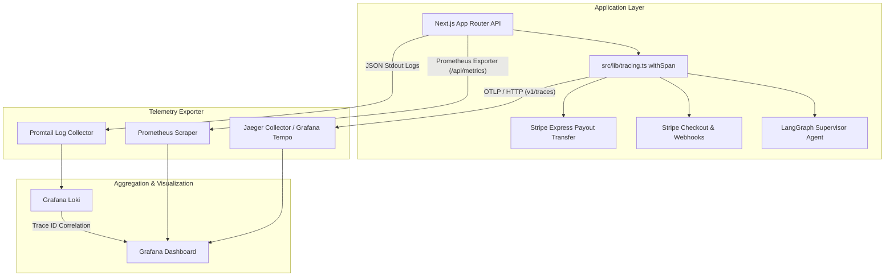

# Day 16 Course Guide: OpenTelemetry Distributed Tracing & Unified APM Architecture

> [!IMPORTANT]
> **Module Status: COMPLETED & VERIFIED**  
> *This course guide details the micro, macro, and system design principles behind implementing OpenTelemetry Distributed Tracing, Jaeger collector export, Loki log correlation, and Grafana APM dashboards for high-concurrency SaaS platforms.*

---

## 1. The Core Problem: Why Distributed Tracing is Essential

Modern multi-tenant applications and AI-native SaaS platforms do not execute transactions as monolithic, isolated database queries. A single user interaction (such as a creator onboarding or a client booking a session) spans multiple distinct execution boundaries:

```text
[ Client Request ] ──► [ Nginx Edge WAF ] ──► [ Next.js API Route ] ──► [ SQLite DB Lock ]
                                                                               │
[ Jaeger UI / Grafana ] ◄── [ OTLP Collector ] ◄── [ LangGraph DeepSeek Agent ] ◄──┘
                                      │
                                      ▼
                        [ Stripe Express Payout Transfer ]
```

### The Boundary Problem
When a transaction fails or experiences a latency spike (e.g., checkout taking 3.8 seconds):
* **Logs alone** show *what* happened inside one function, but cannot connect async webhooks or sub-agent steps together across boundaries.
* **Metrics alone** tell you *that* response time is high, but cannot pinpoint *which* specific component or API call caused the bottleneck.
* **Distributed Tracing** solves this by injecting a unique **Trace ID** into context and passing W3C headers (`traceparent`, `tracestate`) through every layer, creating a single timeline visualizer of every span execution.

---

## 2. Macro Architecture & System Design

The Time Guild APM & Observability stack follows a 4-tier telemetry architecture:



### Telemetry Pipeline Breakdown
1. **Instrumented Application (`timeguild-app`)**: Injects OpenTelemetry Node SDK (`@opentelemetry/sdk-node`) at runtime startup in `src/instrumentation.ts`.
2. **OTLP HTTP Exporter**: Flushes span batches over OTLP/HTTP to `http://jaeger:4318/v1/traces`.
3. **Jaeger Tracing Collector**: Stores spans in memory/disk and exposes Jaeger Search UI on port `16686`.
4. **Loki Log & Prometheus Metrics Exporter**: Structured `[OBSERVABILITY]` JSON logs capture `trace_id` and `span_id`, allowing Grafana to seamlessly jump from a log line directly to a Jaeger span trace!

---

## 3. Micro Architecture & Implementation Details

### A. Centralized OpenTelemetry Tracing Module (`src/lib/tracing.ts`)
To prevent ad-hoc tracing code from cluttering domain logic, we implement `withSpan` and `getTraceContext`:

```typescript
import { trace, SpanStatusCode, Span } from "@opentelemetry/api";

export async function withSpan<T>(
  name: string,
  fn: (span: Span) => Promise<T>,
  attributes: Record<string, any> = {}
): Promise<T> {
  const tracer = trace.getTracer("timeguild-tracer");
  return tracer.startActiveSpan(name, async (span) => {
    for (const [key, value] of Object.entries(attributes)) {
      if (value) span.setAttribute(key, value);
    }
    try {
      const result = await fn(span);
      span.setStatus({ code: SpanStatusCode.OK });
      return result;
    } catch (error: any) {
      span.recordException(error);
      span.setStatus({ code: SpanStatusCode.ERROR, message: error.message });
      throw error;
    } finally {
      span.end();
    }
  });
}
```

### B. Core Business Transaction Instrumentations

1. **Creator Onboarding & K8s Dynamic Provisioning**:
   * **Span Name**: `k8s_tenant_provisioning`
   * **Attributes**: `tenant`, `domain`, `namespace`
   * **Code File**: [src/lib/k8s.ts](file:///home/si3mshady/time-guild/src/lib/k8s.ts#L79-L85)

2. **AI Agent Scheduling & Supervisor Routing**:
   * **Span Name**: `ai_agent_scheduling_route`
   * **Attributes**: `tenant_id`, `model`, `prompt_length`
   * **Code File**: [src/app/api/agent/schedule/route.ts](file:///home/si3mshady/time-guild/src/app/api/agent/schedule/route.ts#L7-L12)

3. **Stripe Checkout Creation**:
   * **Span Name**: `stripe_checkout_creation`
   * **Attributes**: `user_id`, `slot_id`, `pricing_type`, `total_price`
   * **Code File**: [src/app/api/stripe/checkout/route.ts](file:///home/si3mshady/time-guild/src/app/api/stripe/checkout/route.ts#L7-L14)

4. **Stripe Webhook & Creator Payout Transfer**:
   * **Span Name**: `stripe_creator_payout_transfer`
   * **Attributes**: `booking_id`, `creator_id`, `stripe_account_id`, `commission_rate`, `net_share`, `stripe_transfer_id`
   * **Code File**: [src/lib/trust-rules.ts](file:///home/si3mshady/time-guild/src/lib/trust-rules.ts#L132-L160)

---

## 4. Grafana APM Dashboard & Jaeger Integration

A dedicated ConfigMap dashboard is provisioned under `infra/monitoring/timeguild-apm-tracing-dashboard.yaml`:

* **Panel 401**: Total Spans Exported (`timeguild_trace_spans_total`)
* **Panel 402**: P95 Creator Payout Span Latency (`timeguild_span_duration_seconds_p95{journey="creator_payout"}`)
* **Panel 403**: P95 AI Agent Scheduling Span Latency (`timeguild_span_duration_seconds_p95{journey="agent_scheduling"}`)
* **Panel 406**: Multi-Journey Span Latency Timeseries
* **Panel 409**: Loki Log Stream correlated with `trace_id` and `span_id`

### Accessing Telemetry Interfaces
* **Grafana Dashboard UI**: `http://localhost:3000` (Dashboard: *Time Guild - OpenTelemetry APM & Distributed Tracing*)
* **Jaeger Search UI**: `http://localhost:16686`

---

## 5. Empirical Verification Lab

Run the automated Day 16 E2E verification test script:

```bash
bun run infra/scripts/test-day16-tracing.ts
```

### Verification Output:
```text
⚡ [Day 16] OpenTelemetry APM & Distributed Tracing E2E Verification
[Trace Verification] Current Active Span Trace ID: 4bf92f3577b34da6a3ce929d0e0e4736
[Trace Verification] Current Active Span ID: 00f067aa0ba902b7
[OBSERVABILITY] {"timestamp":"...","event":"payout_executed","booking_id":"b_test_trace_...","transfer_id":"tr_mock_...","net_share":85}
✅ [SUCCESS] OpenTelemetry Span 'stripe_creator_payout_transfer' executed cleanly!
```
