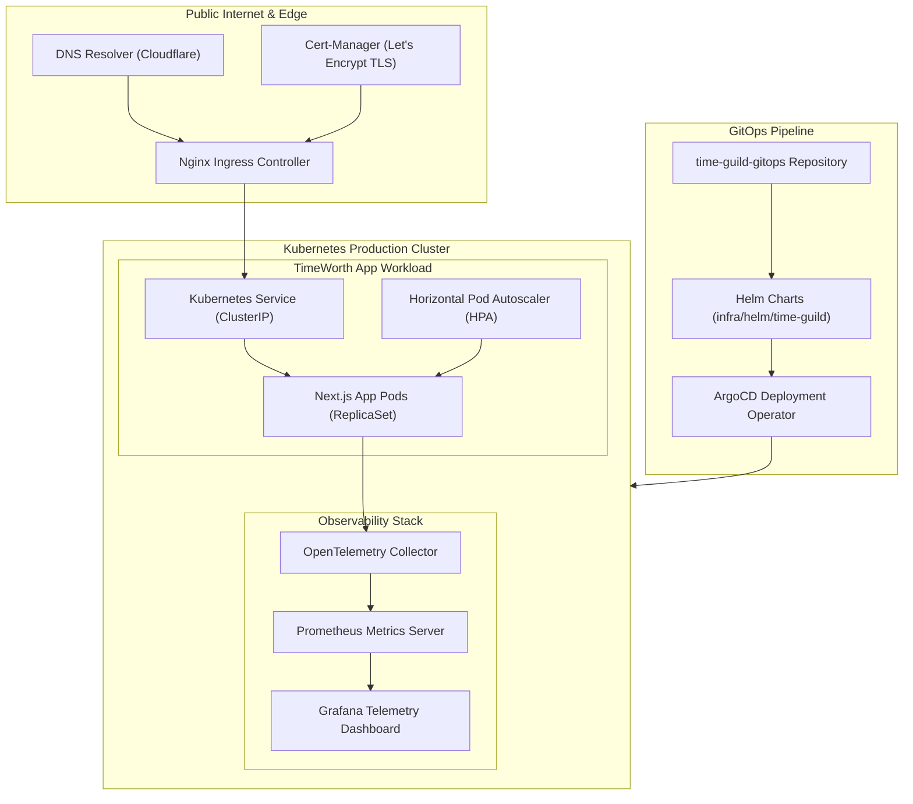

# 🌐 Infrastructure & GitOps System Architecture Blueprint

> **Repository:** `~/time-guild-gitops` (Infrastructure & Deployment Base)  
> **Document Name:** Infra System Design  
> **Date:** July 27, 2026  

---

## 📐 1. Infrastructure Architecture Overview

**TimeWorth GitOps Infrastructure** manages container orchestration, automated deployment pipelines, observability telemetry, ingress routing with TLS termination, and network security across all Kubernetes deployment targets.



---

## ⚙️ 2. Repository Layout & Helm Deployment Setup

```text
infra/
├── helm/
│   └── time-guild/            # Main Helm Chart for TimeWorth App
│       ├── Chart.yaml         # Chart metadata
│       ├── values.yaml        # Default values (replicas, image tags, env)
│       └── templates/
│           ├── deployment.yaml# Kubernetes Deployment spec
│           ├── service.yaml   # ClusterIP Service spec
│           ├── ingress.yaml   # Ingress rules with TLS termination
│           └── hpa.yaml       # Horizontal Pod Autoscaler (CPU/Mem target 75%)
└── k8s/
    └── grafana-ingress.yaml   # Grafana Ingress Route with TLS
```

---

## 📊 3. Observability & Telemetry Architecture

* **OpenTelemetry Collector**: Intercepts application trace spans and metrics via standard OTLP HTTP protocols (`/v1/traces`).
* **Prometheus Metrics Engine**: Aggregates pod CPU, memory, request latency, and HTTP response status code distribution.
* **Grafana Dashboards**: Renders real-time platform metrics, pod health, and error rate telemetry accessible via secure Ingress.

---

## 🔒 4. Network Security & TLS Termination

* **Automated TLS Certificates**: Cert-Manager automatically requests and renews Let's Encrypt X.509 TLS certificates.
* **Ingress Guarding**: All external HTTP traffic is automatically redirected to HTTPS (TLS 1.3).
* **Environment Variable Isolation**: Production API keys and secrets are injected via Kubernetes Secrets (`SecretProviderClass` / Vault integration).

---

## 🔄 5. GitOps Continuous Deployment Pipeline

1. **Commit & Push**: Developers push updates to `time-guild-gitops`.
2. **Helm Rendering**: ArgoCD / Flux GitOps operator monitors `infra/helm/time-guild` for changes.
3. **Automated Rollout**: Kubernetes performs zero-downtime rolling updates (`maxSurge: 25%`, `maxUnavailable: 0`).
