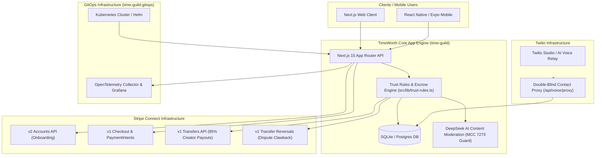
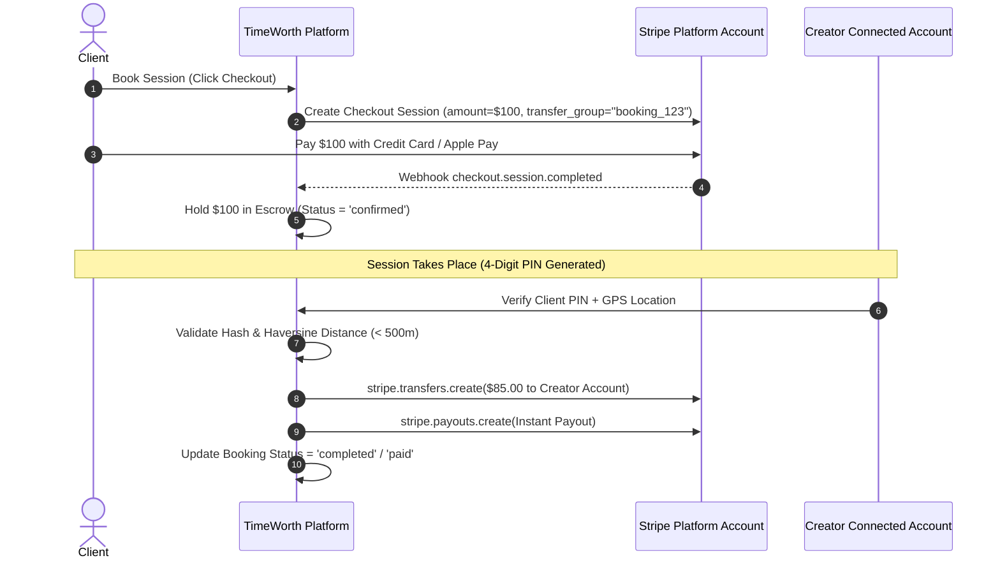

# 🏗️ Complete System Architecture & Engineering Blueprint: TimeWorth Marketplace

> **Document Name:** System Design Explained  
> **Target Repositories:** `~/time-guild` (App Codebase) & `~/time-guild-gitops` (Infrastructure & GitOps)  
> **Date:** July 27, 2026  

---

## 📐 1. Executive System Architecture Overview

**TimeWorth** is a multi-tenant, trust-first marketplace platform designed for structured time sessions (coaching, mentoring, technical consulting, local guided tours, and skills tutoring). The system combines an **Escrow Payment Engine** built on Stripe Connect with a **Physical/Virtual Verification System (PIN + GPS telemetry)**, **Double-Blind Telephony Masking**, and **Automated Financial Compliance (Form 1099-K Tax Ledger & Chargeback Reversal Engine)**.

### High-Level System Architecture Diagram



---

## 💻 2. Application Layer Architecture (`~/time-guild`)

### Tech Stack
* **Framework**: Next.js 15 (App Router), React 19, TypeScript
* **Styling**: TailwindCSS with dark mode & glassmorphism components
* **Database**: SQLite (`better-sqlite3`) for local/edge; Supabase Postgres migrations for cloud
* **Payment Engine**: Stripe Node SDK (`stripe`), hybrid v1/v2 API architecture
* **Observability**: OpenTelemetry Node SDK (`@opentelemetry/sdk-node`)

### Core Module Breakdown

```text
src/
├── app/
│   ├── api/
│   │   ├── admin/             # Admin stats, skipped transfer retry, dashboard endpoints
│   │   ├── slots/             # Availability slot CRUD & Server-Side KYC Gate
│   │   ├── stripe/            # Stripe Checkout, Connect onboarding, & Webhook listener
│   │   └── voice/             # Twilio Voice Relay & Double-Blind Proxy endpoints
│   ├── dashboard/             # Multi-tab Provider/Client/Admin Dashboard UI
│   └── page.tsx               # Marketplace Discovery Landing Page
├── lib/
│   ├── db.ts                  # Database schema definitions, tables, and 1099-K SQL view
│   ├── stripe.ts              # Stripe SDK initialization & environment mode resolver
│   ├── trust-rules.ts         # Core business logic: escrow hold, PIN verification, refunds, dispute reversals
│   ├── resilience.ts          # Circuit breaker & retry wrapper for external APIs
│   └── agent/
│       └── guardrails.ts      # DeepSeek Layer 1/2 AI Content Moderation (MCC 7273 compliance)
```

### Payment & Escrow Engine Deep-Dive ([src/lib/trust-rules.ts](file:///home/si3mshady/time-guild/src/lib/trust-rules.ts))

The escrow lifecycle operates under **Separate Charges & Transfers (SCT)**:



#### Financial Split Breakdown (on $100 Session)
1. **Client Paid Amount**: `$100.00`
2. **Platform Commission (15%)**: `$15.00`
3. **Stripe Processing Fee (2.9% + $0.30)**: `~$3.20`
4. **Platform Net Profit Margin**: `$11.80` (**11.8% Net Margin**)
5. **Creator Net Payout (85%)**: `$85.00`

---

## 🗄️ 3. Database Schema & Data Models ([src/lib/db.ts](file:///home/si3mshady/time-guild/src/lib/db.ts))

### Key Tables Overview

1. `users`: Stores client and creator identities, authentication tokens, roles (`client`, `creator`, `admin`), and tenant IDs.
2. `creator_profiles`: Stores hourly/session rates, bios, skills, weekly slot limits, and verification status.
3. `stripe_accounts`: Stores Stripe Express Connected Account IDs (`acct_...`), KYC status flags (`charges_enabled`, `payouts_enabled`, `details_submitted`), and onboarding links.
4. `slots`: Stores provider availability windows (`start_time`, `end_time`, `status`: `available`, `reserved`, `booked`).
5. `bookings`: Stores transaction records, `stripe_checkout_session_id`, `stripe_charge_id`, `stripe_transfer_id`, `pin_hash`, and status (`confirmed`, `completed`, `paid`, `refunded`, `disputed`).
6. `skipped_transfers`: Telemetry queue recording payouts skipped due to incomplete creator KYC, allowing one-click admin retries.
7. `session_masked_contacts`: Stores temporary virtual proxy phone numbers mapping client and creator cell numbers during active booking windows.
8. `webhook_logs`: Audit trail recording raw Stripe webhook event IDs, types, and execution timestamps.

### Form 1099-K Tax Ledger SQL View (`v_creator_1099k_ledger`)
Calculates annual gross payment volume and transaction counts per provider:
```sql
CREATE VIEW IF NOT EXISTS v_creator_1099k_ledger AS
SELECT 
  u.id as creator_id,
  u.display_name as creator_name,
  u.email as creator_email,
  sa.stripe_account_id,
  strftime('%Y', b.created_at) as tax_year,
  COUNT(b.id) as transaction_count,
  SUM(b.price_paid) as gross_payment_volume,
  CASE WHEN SUM(b.price_paid) >= 600 THEN 1 ELSE 0 END as state_threshold_exceeded,
  CASE WHEN SUM(b.price_paid) >= 20000 AND COUNT(b.id) >= 200 THEN 1 ELSE 0 END as federal_threshold_exceeded
FROM users u
JOIN bookings b ON u.id = b.creator_id
LEFT JOIN stripe_accounts sa ON u.id = sa.user_id
WHERE b.status IN ('confirmed', 'completed', 'paid')
GROUP BY u.id, tax_year;
```

---

## ⚙️ 4. Infrastructure & GitOps Architecture (`~/time-guild-gitops`)

### Repository Layout
```text
time-guild-gitops/
├── infra/
│   ├── helm/                  # Helm charts for TimeWorth App deployment
│   │   └── time-guild/        # Templates: Deployment, Service, Ingress, HPA
│   └── k8s/                   # Kubernetes manifests & Grafana Ingress
├── docs/
│   ├── daily-logs/            # Mirrored daily logs & Jira schedules
│   ├── diagnostics/            # Beta readiness assessment reports
│   └── system-design-explained/# Master System Design Architecture Blueprint
```

### Deployment Pipeline
* **GitOps Continuous Deployment**: Changes pushed to `origin/main` automatically trigger Helm chart deployment updates in Kubernetes.
* **Lovable Synchronization**: Connected to Lovable editor, preserving clean commit history.

---

## 🔒 5. Security, Compliance & MCC 7273 Risk Mitigation

```text
COMPLIANCE AREA        IMPLEMENTATION SPECIFICATION                                STATUS
---------------------------------------------------------------------------------------------------
PCI DSS Scope          Stripe Hosted Checkout / PaymentSheet (No raw card data)     [x] FULLY COMPLIANT
MCC 7273 Policy        DeepSeek AI Content Moderation & Skills-only framing          [x] FULLY COMPLIANT
KYC Verification       Stripe Express v2 Core Account Links & Server 403 Gate      [x] FULLY COMPLIANT
Data Privacy           Double-Blind Telephony Proxy (Virtual Phone Number Pool)     [x] FULLY COMPLIANT
Tax Compliance         Automated Form 1099-K Tax Ledger SQL View                    [x] FULLY COMPLIANT
```

---

## 🏁 Summary

This System Design document represents the complete engineering, architectural, and infrastructure blueprint of the TimeWorth platform. The codebase in `~/time-guild` and infrastructure in `~/time-guild-gitops` form a production-hardened foundation ready for real-world testing.
