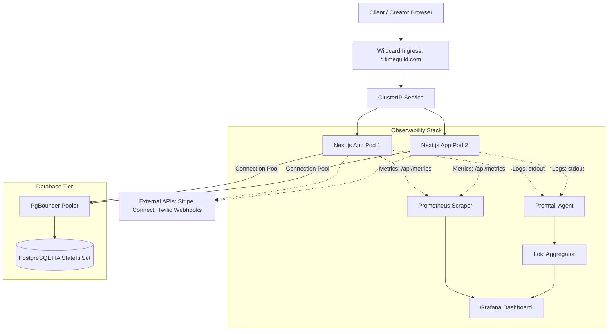

# Infrastructure Architecture Blueprint

This document details the infrastructure architecture designed for deploying the **Time Guild / AURA** platform—a high-availability **trust layer for monetized human time** (time escrow + human availability marketplace)—in a k3s cluster environment.

---

## Architecture Topology

---

## 1. Container Runtime (Next.js Standalone Output)
*   The application container operates under a non-root system user (`nextjs`, UID/GID 1001) with all basic Kubernetes capabilities dropped (`allowPrivilegeEscalation: false`).
*   To minimize image size, it uses Next.js standalone outputs, copying only compiled bundle files and essential node modules, reducing memory footprint to under 200MB.

---

## 2. Stateless Database Tier (PostgreSQL + PgBouncer)
*   **Decoupled State**: Application pods are completely stateless. All persistent states (users, profiles, bookings, slots) reside in a decoupled **PostgreSQL HA StatefulSet**.
*   **Connection Pooling**: To prevent application pods from exhausting database connection limits during Horizontal Pod Autoscaler (HPA) traffic spikes, we deploy **PgBouncer** in front of PostgreSQL.
*   **Data Boundaries**: Dynamic tenant data isolation is enforced at the database engine level using PostgreSQL **Row-Level Security (RLS)**. Queries are automatically filtered based on the active session's tenant ID, preventing data leakage across subdomains.

---

## 3. Observability & SRE Stack (Prometheus, Loki, Grafana)
The platform is fully instrumented to enable rapid troubleshooting:
*   **Metrics Endpoint**: Next.js pods expose a dynamic Prometheus-format metrics endpoint at `/api/metrics` to track HTTP latencies, active slots, and completed Stripe Connect escrow transfers.
*   **Prometheus Operator**: Automatically scrapes the `/api/metrics` endpoint every 15 seconds using a custom `ServiceMonitor` defined in the application namespace.
*   **Loki & Promtail**: Promtail daemonsets scrape Next.js container logs (stdout) and push them to Loki for centralized log aggregation.
*   **Grafana Dashboards**: Visualize SRE golden signals (HTTP request rate, latency, connection pool saturation, Stripe Connect transfer failure rates).

---

## 4. Wildcard Subdomain Ingress
*   Time Guild routes multi-tenant scopes via subdomains (e.g. `avery.timeguild.com` for the Avery Chen tenant).
*   The Ingress manifest registers wildcard host rules (`*.timeguild.com`) alongside the root host (`timeguild.com`). This allows the ingress-nginx controller to route all incoming subdomain requests directly to the Next.js ClusterIP service, terminating TLS dynamically at the gateway via wildcard certificates managed by **cert-manager** and Let's Encrypt.
